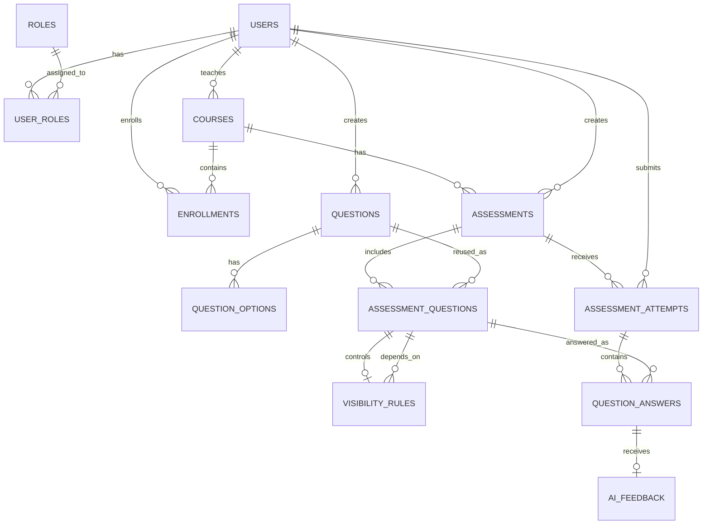

# Database Design

## Overview

This document defines the initial database design for Dynamic Assessment API.

The goal of this document is to translate the domain model into a relational data model suitable for PostgreSQL.

This design defines the main tables, relationships, constraints, and data consistency decisions required for the MVP.

---

## Design Goals

The database design must support:

- Users with multiple roles.
- Courses assigned to teachers.
- Student enrollments.
- A shared reusable question bank.
- Assessments built from reusable questions.
- Dynamic visibility rules.
- Partial answers and resumable attempts.
- Automatic grading.
- AI-generated feedback for open-text answers.
- Soft delete for selected entities.

---

## Tables Overview

The initial database model includes the following tables:

```text
users
roles
user_roles

courses
enrollments

questions
question_options

assessments
assessment_questions
visibility_rules

assessment_attempts
question_answers
ai_feedback
```

---

## Tables

## users

Stores user accounts.

A user may have one or more roles.

### Main fields

```text
id
email
hashed_password
full_name
is_active
created_at
updated_at
```

### Constraints

```text
id PRIMARY KEY
email UNIQUE NOT NULL
hashed_password NOT NULL
full_name NOT NULL
is_active NOT NULL
created_at NOT NULL
updated_at NOT NULL
```

### Notes

The system does not use a single `role` field in the `users` table.

Roles are assigned through the `user_roles` table.

---

## roles

Stores the available system roles.

### Main fields

```text
id
name
description
created_at
```

### Initial values

```text
admin
teacher
student
```

### Constraints

```text
id PRIMARY KEY
name UNIQUE NOT NULL
description NULL
created_at NOT NULL
```

---

## user_roles

Stores the many-to-many relationship between users and roles.

This table allows a user to have multiple roles.

### Main fields

```text
id
user_id
role_id
created_at
```

### Relationships

```text
user_roles.user_id -> users.id
user_roles.role_id -> roles.id
```

### Constraints

```text
id PRIMARY KEY
user_id NOT NULL
role_id NOT NULL
UNIQUE(user_id, role_id)
created_at NOT NULL
```

---

## courses

Stores academic courses.

Each course has one responsible teacher.

### Main fields

```text
id
teacher_id
name
description
is_active
created_at
updated_at
```

### Relationships

```text
courses.teacher_id -> users.id
```

### Constraints

```text
id PRIMARY KEY
teacher_id NOT NULL
name NOT NULL
description NULL
is_active NOT NULL
created_at NOT NULL
updated_at NOT NULL
```

### Business validation

The `teacher_id` must reference a user with the `teacher` role.

This rule is enforced by the service layer.

---

## enrollments

Stores the relationship between students and courses.

A student may be enrolled in many courses, and a course may contain many students.

### Main fields

```text
id
course_id
student_id
is_active
created_at
updated_at
```

### Relationships

```text
enrollments.course_id -> courses.id
enrollments.student_id -> users.id
```

### Constraints

```text
id PRIMARY KEY
course_id NOT NULL
student_id NOT NULL
UNIQUE(course_id, student_id)
is_active NOT NULL
created_at NOT NULL
updated_at NOT NULL
```

### Business validation

The `student_id` must reference a user with the `student` role.

This rule is enforced by the service layer.

---

## questions

Stores reusable questions from the shared question bank.

### Supported question types

```text
single_choice
multiple_choice
open_text
number
boolean
scale
```

### Main fields

```text
id
created_by_id
type
statement
image_path
config_json
is_active
created_at
updated_at
```

### Relationships

```text
questions.created_by_id -> users.id
```

### Constraints

```text
id PRIMARY KEY
created_by_id NOT NULL
type NOT NULL
statement NOT NULL
image_path NULL
config_json NULL
is_active NOT NULL
created_at NOT NULL
updated_at NOT NULL
```

### Notes

`image_path` stores the relative path of the image served by the backend.

The API may expose this path as a public URL for the frontend.

`config_json` stores type-specific configuration.

Examples:

For a `number` question:

```json
{
  "min": 0,
  "max": 100,
  "tolerance": 0.1
}
```

For an `open_text` question:

```json
{
  "min_length": 20,
  "max_length": 1000
}
```

For a `scale` question:

```json
{
  "min": 1,
  "max": 5
}
```

### Business rules

- Questions are reusable.
- Questions are not editable in the MVP.
- Questions may be deactivated using soft delete.
- Each question may contain at most one image.

---

## question_options

Stores answer options for questions that require predefined choices.

### Applies mainly to

```text
single_choice
multiple_choice
boolean
scale
```

### Main fields

```text
id
question_id
label
value
is_correct
is_exclusive
order_index
created_at
```

### Relationships

```text
question_options.question_id -> questions.id
```

### Constraints

```text
id PRIMARY KEY
question_id NOT NULL
label NOT NULL
value NOT NULL
is_correct NOT NULL
is_exclusive NOT NULL
order_index NOT NULL
created_at NOT NULL
```

### Business rules

- A question may have multiple options.
- An option belongs to one question.
- A `single_choice` question should have only one correct option.
- A `multiple_choice` question may have multiple correct options.
- An exclusive option cannot be combined with other options in the same answer.

These rules are enforced by the service layer.

---

## assessments

Stores evaluative activities associated with courses.

### Supported assessment types

```text
quiz
workshop
exam
form
```

### Supported statuses

```text
draft
published
archived
```

### Main fields

```text
id
course_id
created_by_id
type
title
description
status
created_at
updated_at
published_at
```

### Relationships

```text
assessments.course_id -> courses.id
assessments.created_by_id -> users.id
```

### Constraints

```text
id PRIMARY KEY
course_id NOT NULL
created_by_id NOT NULL
type NOT NULL
title NOT NULL
description NULL
status NOT NULL
created_at NOT NULL
updated_at NOT NULL
published_at NULL
```

### Business rules

- Every assessment belongs to one course.
- An assessment must be published before students can answer it.
- Only students enrolled in the course can access the assessment.

---

## assessment_questions

Stores the relationship between assessments and questions.

This table is required because assessments and questions have a many-to-many relationship.

It also stores assessment-specific configuration for each question.

### Main fields

```text
id
assessment_id
question_id
order_index
points
is_required
created_at
```

### Relationships

```text
assessment_questions.assessment_id -> assessments.id
assessment_questions.question_id -> questions.id
```

### Constraints

```text
id PRIMARY KEY
assessment_id NOT NULL
question_id NOT NULL
order_index NOT NULL
points NOT NULL
is_required NOT NULL
UNIQUE(assessment_id, question_id)
UNIQUE(assessment_id, order_index)
created_at NOT NULL
```

### Notes

This table stores information that belongs to the question only within a specific assessment:

- order
- score
- required flag

---

## visibility_rules

Stores dynamic visibility rules for assessment questions.

A visibility rule controls whether a question should be shown depending on a previous answer.

### Main fields

```text
id
assessment_question_id
depends_on_assessment_question_id
operator
expected_value_json
created_at
```

### Relationships

```text
visibility_rules.assessment_question_id -> assessment_questions.id
visibility_rules.depends_on_assessment_question_id -> assessment_questions.id
```

### Supported operators

```text
equals
not_equals
contains
greater_than
less_than
```

### Constraints

```text
id PRIMARY KEY
assessment_question_id UNIQUE NOT NULL
depends_on_assessment_question_id NOT NULL
operator NOT NULL
expected_value_json NOT NULL
created_at NOT NULL
```

### Notes

The `UNIQUE(assessment_question_id)` constraint enforces the MVP rule:

```text
Each assessment question may have at most one visibility rule.
```

---

## assessment_attempts

Stores student attempts for assessments.

An attempt represents a student's work on an assessment.

### Supported statuses

```text
in_progress
submitted
graded
```

### Main fields

```text
id
assessment_id
student_id
status
attempt_number
score
started_at
submitted_at
graded_at
created_at
updated_at
```

### Relationships

```text
assessment_attempts.assessment_id -> assessments.id
assessment_attempts.student_id -> users.id
```

### Constraints

```text
id PRIMARY KEY
assessment_id NOT NULL
student_id NOT NULL
status NOT NULL
attempt_number NOT NULL
score NULL
started_at NOT NULL
submitted_at NULL
graded_at NULL
created_at NOT NULL
updated_at NOT NULL
UNIQUE(assessment_id, student_id, attempt_number)
```

### Business validation

A student should not have more than one `in_progress` attempt for the same assessment.

This rule is enforced by the service layer in the MVP.

It may later be reinforced using a PostgreSQL partial unique index.

---

## question_answers

Stores student answers for assessment questions.

Each answer belongs to one attempt and one assessment question.

### Main fields

```text
id
attempt_id
assessment_question_id
answer_json
score
feedback
created_at
updated_at
```

### Relationships

```text
question_answers.attempt_id -> assessment_attempts.id
question_answers.assessment_question_id -> assessment_questions.id
```

### Constraints

```text
id PRIMARY KEY
attempt_id NOT NULL
assessment_question_id NOT NULL
answer_json NOT NULL
score NULL
feedback NULL
created_at NOT NULL
updated_at NOT NULL
UNIQUE(attempt_id, assessment_question_id)
```

### Why answer_json?

`answer_json` is used because answers may have different structures depending on the question type.

Examples:

```text
single_choice   -> "A"
multiple_choice -> ["A", "C"]
number          -> 3.14
boolean         -> true
open_text       -> "The time constant represents..."
scale           -> 4
```

This flexible structure allows the system to support dynamic forms while keeping the table simple.

The service layer is responsible for validating the expected answer structure.

---

## ai_feedback

Stores AI-generated feedback for open-text answers.

### Supported statuses

```text
pending
completed
failed
```

### Main fields

```text
id
question_answer_id
provider
model
prompt
raw_response
feedback_text
status
created_at
updated_at
```

### Relationships

```text
ai_feedback.question_answer_id -> question_answers.id
```

### Constraints

```text
id PRIMARY KEY
question_answer_id UNIQUE NOT NULL
provider NOT NULL
model NOT NULL
prompt NULL
raw_response NULL
feedback_text NULL
status NOT NULL
created_at NOT NULL
updated_at NOT NULL
```

### Business rules

- AI feedback is mainly used for `open_text` answers.
- Not every answer requires AI feedback.
- A question answer may have at most one AI feedback record in the MVP.
- If AI feedback generation fails, the saved student answer must not be corrupted.

---

## Important Relationships

### Users and Roles

```text
users N --- N roles
```

Implemented through:

```text
user_roles
```

---

### Teachers and Courses

```text
users 1 --- N courses
```

A teacher may own many courses.

Each course has one responsible teacher.

---

### Students and Courses

```text
users N --- N courses
```

Implemented through:

```text
enrollments
```

---

### Courses and Assessments

```text
courses 1 --- N assessments
```

A course may have many assessments.

Each assessment belongs to one course.

---

### Questions and Options

```text
questions 1 --- N question_options
```

A question may have multiple options.

---

### Assessments and Questions

```text
assessments N --- N questions
```

Implemented through:

```text
assessment_questions
```

---

### Assessment Questions and Visibility Rules

```text
assessment_questions 1 --- 0..1 visibility_rules
```

An assessment question may have one visibility rule.

---

### Assessments and Attempts

```text
assessments 1 --- N assessment_attempts
```

An assessment may receive many attempts.

---

### Students and Attempts

```text
users 1 --- N assessment_attempts
```

A student may have many attempts.

---

### Attempts and Answers

```text
assessment_attempts 1 --- N question_answers
```

An attempt contains multiple answers.

---

### Answers and AI Feedback

```text
question_answers 1 --- 0..1 ai_feedback
```

An open-text answer may receive AI feedback.

---

## Design Decisions

### Users with multiple roles

The system uses:

```text
users
roles
user_roles
```

instead of a single `role` column in `users`.

This allows one user to have more than one role.

---

### Students and teachers are users

The system does not use separate `students` or `teachers` tables in the MVP.

A student is a user with the `student` role.

A teacher is a user with the `teacher` role.

---

### Questions are reusable

Questions do not belong directly to assessments.

Questions are connected to assessments through:

```text
assessment_questions
```

This allows questions to be reused across multiple assessments.

---

### Answers reference assessment questions

Student answers reference:

```text
assessment_questions
```

instead of directly referencing only:

```text
questions
```

This is important because a question may have a different order, score, or required flag depending on the assessment.

---

### Question images use image_path

Each question may have one image.

The database stores the image path in:

```text
questions.image_path
```

A separate image table is not required for the MVP.

---

### Visibility rules belong to assessment questions

Visibility rules are linked to:

```text
assessment_questions
```

not directly to general questions.

This is because dynamic visibility depends on the specific assessment form.

---

### Flexible answers use answer_json

Student answers are stored in:

```text
question_answers.answer_json
```

This supports different answer formats for different question types.

The service layer validates the answer structure.

---

### AI feedback is separated

AI feedback is stored in a separate table:

```text
ai_feedback
```

This allows the system to track provider, model, status, prompt, raw response, and generated feedback independently from the student answer.

---

## Entity-Relationship Diagram



---

## Consistency Review

The model avoids unnecessary duplication by representing students and teachers as users with roles.

The model supports reusable questions through the `assessment_questions` table.

The model supports dynamic forms through `visibility_rules`.

The model supports resumable attempts through `assessment_attempts` and `question_answers`.

The model supports flexible answer formats using `answer_json`.

The model supports AI feedback without mixing external provider data directly into student answers.

---

## Notes

This document defines the initial relational design for the MVP.

It does not define SQLAlchemy models, Alembic migrations, API endpoints, or service implementation details.

Those decisions are handled in later phases.